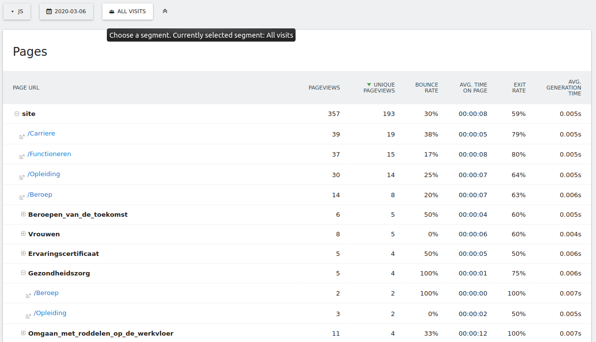

# Matomo tracking configurations
To test the different tracking options and configurations that Matomo provides the log replay mechanism can be used. 
By testing different configurations with the same log, replayed to compare collected data. This then can be verified with the Matomo documentation on the different configurations.

A log is generated for replay purposes. Each request in the generated access log is fired to a web page. This webpage is tracked with three different Matomo configurations:
* A Matomo configuration with standard JavaScript tracking. (JS)
* A Matomo configuration only using beacon tracking. (Beacon / pixel)
* A Matomo configuration with JavaScript tracking with cookies disabled. (Fingerprint)

## Comparison of collection
We expect that by not using cookies (Fingerprint and Beacon) in contrast to the other tracking option (JS) the session differentiation does not work. This means that there is no difference in returning visitors and new visitors. Each new visitor will have a new session when no cookies are found. The hierarchy of recognizing users is described in [2]. The impact this has on reports is explained in the Matomo documentation[1].

| Data point                        | JS | Beacon | Fingerprint |
|-----------------------------------|----|--------|-------------|
| Session differentiation           | y  | x      | x           |

Based on expected differences between JS and Beacon tracking in Matomo documentation[3] the following table can be constructed. The functions that *should be incorrect* should work correct for JS and incorrect for the other tracking configurations. The functions that *should be correct* should work for all tracking configurations. Based on the access log replay we observed the following results. 

| Data point                        | JS | Beacon | Fingerprint |
|-----------------------------------|----|--------|-------------|
| *Should be incorrect*             |    |        |             |
| Referrers*                        | -  | -      | -           |
| Screen resolutions                | y  | x      | y           |
| Browser plugins                   | y  | x      | y           |
| Page titles                       | y  | x      | y           |
| Time in local user’s timezone     | y  | x      | y           |
| First party tracking cookies      | y  | x      | x           |
| Downloads*                        | -  | -      | -           |
| Outlinks*                         | -  | -      | -           |
| Pages generation time             | y  | x      | y           |
| *Should be correct*               |    |        |             |
| User IP address                   | y  | y      | y           |
| Date and time of the request      | y  | y      | y           |
| URL of the page (Page URL)        | y  | x**    | y           |
| Geo location                      | y  | y      | y           |
| Accept-Language header            | y  | y      | y           |
| User-agent related data           | y  | y      | y           |

\* Not supported by log replaying. 
\*\* Unexpected

We see that unexpected the page url is not working with the Beacon configuration. The documentation states this data should be collected. Although in the Matomo report all page views are contributed to the /index url. Which is not correct compared to the report of other tracking configurations. This is highly likely caused by the missing referrer implementation. The referrer header is the only way for Matomo to record from what page a request originates. When this header is missing the page url is unknown to Matomo. Screenshots are given below demonstrating the issue.

Beacon tracking (no page urls)

Javascript tracking (page title & urls)

## Comparison of collected data
The most important difference can be found in the distinguishing of new and repeated visitors. In the table below we can see how the replayed log is interpreted differently by the JavaScript tracking script with cookies.

| Data point                  | JS   | Beacon | Fingerprint |
|-----------------------------|------|--------|-------------|
| Number of visits            | 113  | 113    | 133         |
| Number of unique visitors   | 99   | 113    | 133         |
| Total page views            | 357  | 357    | 357         | 

We see that only Javascript tracking (by using cookies) is able to differentiate returning visitors. This results in a lower unique visitor count compared to the other configurations because some of the 113 visit are by the same visitors. 

## References
[1] https://matomo.org/faq/general/faq\_156/

[2] https://matomo.org/faq/general/#faq\_21418

[3] https://matomo.org/faq/general/when-tracking-visitors-using-an-image-beacon-instead-of-the-javascript-tracker-what-are-the-differences/

