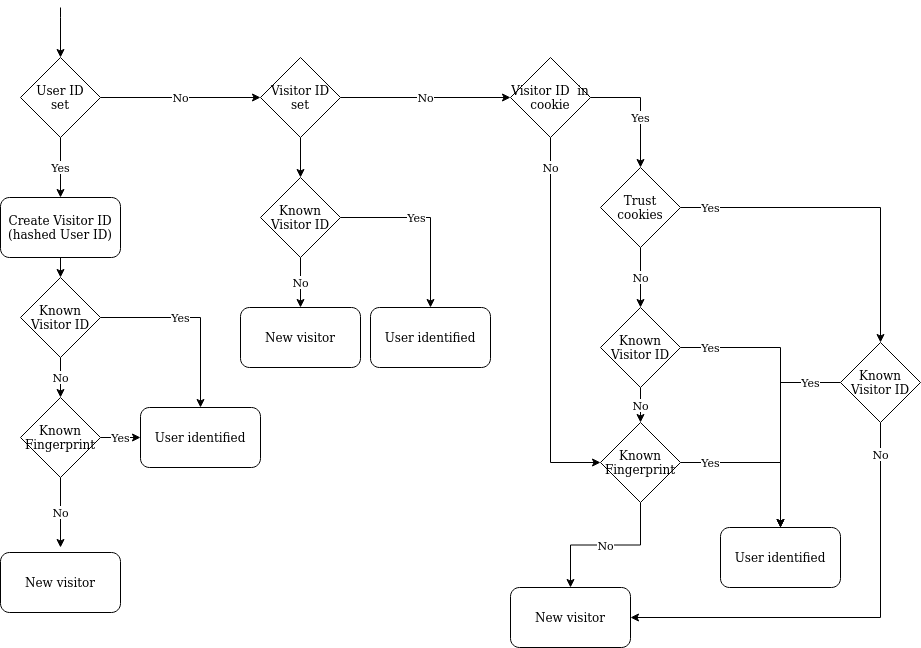

# Privacy in Matomo
Het delen van tracking data met derde partijen zoals Google Analytics levert privacy vragen op. Maar wanneer deze data weer in eigen handen wordt genomen, bijvoorbeeld met behulp van Matomo (open source web analytics), is het ook belangrijk dezelfde vragen te stellen. In lijn met twee eerdere blogs over cookies gaan we hier in op de tools en opties die Matomo biedt voor privacy vriendelijke configuratie.

## Data management
Een aspect van privacy is het beheren en opslaan van de verzamelde tracking data. Matomo heeft hiervoor een [aantal oplossingen](https://matomo.org/docs/privacy/).

### Maskeren en Pseudonimiseren
Een manier om IP adressen deels te anonimiseren is het maskeren van de laatste byte(s). Google analytics past dezelfde methode toe door [standaard de laatste byte te maskeren.](https://support.google.com/analytics/answer/2763052?hl=nl) Matomo laat de beheerder kiezen hoeveel bytes gemaskeerd worden. Dit varieert van geen masking tot het maskeren van de 3 laatste bytes.

Voor het verrijken van informatie over een bezoek kan het IP address worden gebruikt. Twee voorbeeld hiervan zijn: GeoIP om de locatie van een gebruiker te bepalen op basis van het IP address en het maken van een bezoekers vingerafdruk. In de optie 'verrijkte bezoeken' (enriched visits) kan worden geconfigureerd of hiervoor het gehele IP wordt gebruikt of de gemaskeerde versie.

Het is mogelijk om met Matomo gebruikers te volgen op basis van een gebruikers ID of een bestellings ID. Beide gegevens zijn vaak te herleiden naar één unieke gebruiker. Matomo biedt de optie om voor beide gegevens pseudonimisatie toe te passen zodat de data niet direct herleidbaar is naar een klant of gebruiker.

### Anonimisering van historische data
Wanneer geen maskering of pseudonimisering is toegepast [kan dit met terugwerkende kracht worden gedaan](https://matomo.org/faq/how-to/faq_35661/). Hierbij worden de configuratie opties die hierboven beschreven zijn toegepast op de historische data.

### Bewaren van data
Vaak is het niet wenselijk om alle verzamelde data oneindig lang op te slaan. Bijvoorbeeld wanneer data geaggregeerd is in rapporten, kan de originele data vaak verwijderd worden. Matomo maakt het mogelijk [data ouder dan een x aantal dagen te verwijderen](https://matomo.org/faq/troubleshooting/faq_42/). Hierbij wordt onderscheid gemaakt tussen ruwe data, en geaggregeerde data. Zo is het bijvoorbeeld mogelijk ruwe tracking data te verwijderen na 100 dagen, maar de geaggregeerde data een jaar te bewaren. De geaggregeerde data bevat enkel afgeleide statistieken van de ruwe data.

### Importeren van access logs
Matomo biedt ook de optie om [op basis van access logs statistieken af te leiden](https://matomo.org/log-analytics/). Dit kan onder andere worden gebruikt om de privacy van gebruikers te beschermen. Zo kan het op websites met gevoelige data, bijvoorbeeld een medische portal, niet wenselijk zijn Javascript tracking scripts te gebruiken. Om toch statistieken te verzamelen kunnen de logs (die geen gevoelige informatie bevatten) worden geïmporteerd.

## Gebruikers identificatie
Voor veel web analytics statistieken is het belangrijk onderscheid te maken in nieuwe of terugkerende bezoekers. Dit gebeurt veelal met behulp van cookies. Er zijn echter meer mogelijkheden dan het gebruik van cookies. De volgende informatie komt uit [Matomo documentatie over het herkennen van gebruikers](https://matomo.org/faq/general/faq_21418/). Een diagram van het gehele identificatieproces is bij de technische details gevoegd.

### Gebruikers ID & bezoekers ID
Een [gebruikers ID](https://matomo.org/docs/user-id/) kan worden toegevoegd aan de tracking data om gebruikers te herkennen. Dit kan gedaan worden om de tracking data te koppelen aan een gebruiker. Een voordeel van deze techniek is het herkennen van gebruikers op meerdere apparaten. Een andere manier om gebruikers te herkennen is met behulp van een uniek aangemaakt bezoekers ID. Deze kan net als een gebruikers ID handmatig worden toegevoegd aan de tracking data.

**Een voorbeeld:** Een gebruiker is ingelogd op een website met browser A. De gebruikersnaam van de gebruiker wordt als gebruikers ID gebruikt. Dezelfde gebruiker is ook ingelogd op de website op zijn telefoon met browser B. Omdat de gebruikersnaam als gebruikers ID wordt gebruikt zal deze ook als een gebruiker in de statistieken worden getoond. Bij een gegenereerd bezoekers ID zal deze waarde vaak verschillen per browser. (Let op: een website kan ook zelf het beheer van het bezoekers ID doen, zodat deze alsnog verbonden is aan de gebruiker.)

### Cookies
Wanneer een gebruikers ID of bezoekers ID niet expliciet is toegevoegd aan de tracking data zal matomo op zoek gaan naar een bezoekers ID in de cookies.

Matomo plaatst verschillende cookies. Hieronder worden enkele belangrijke benoemd:
* \_pk\_id, - 13 maanden geldig - Gebruikt om details van de user op te slaan, zoals het bezoekers ID.
* \_pk\_ses - Geldig voor de duur van een sessie - Gebruikt om sessie data op te slaan.
* mtm\_consent - Altijd geldig - Gebruikt om gebruiker consent op te slaan. Het is mogelijk om een maximale geldigheidsperiode op te geven voor consent.

De cookies worden standaard geplaatst op het domein van de site. Bijvoorbeeld: Matomo cookies op nogadata.nl worden geplaatst met domein nogadata.nl. [Dit worden first-party cookies genoemd](https://developer.mozilla.org/en-US/docs/Web/HTTP/Cookies#Tracking\_and\_privacy). In tegenstelling tot third-party cookies, waarvan het domein niet overeenkomt met het domein van de pagina. Een voorbeeld hiervan is DoubleClick.net een advertentie domein van Google. Dit betekent dat een gebruiker op elke pagina met advertenties van doubleclick.net kan worden geïdentificeerd. Deze techniek kan echter ook gebruikt worden om een gebruiker over meerdere domeinen te identificeren met Matomo.

Google analytics maakt standaard geen gebruik van third-party cookies. [Maar hierbij geldt het volgende: ](https://developers.google.com/analytics/devguides/collection/analyticsjs/cookie-usage?hl=nl)
```
"For customers that are using Google Analytics' Display Advertiser features, such as remarketing, a third-party DoubleClick cookie is used in addition to the other cookies described in this document for just these features. For more information about this cookie, visit the Google Advertising Privacy FAQ."
```

#### Cookie waarschuwing
Het plaatsen van cookies voor analytics doeleinde is door Prof. Frederik Zuiderveen Borgesius uitgelegd in [deze blog post](https://nogadata.nl/2020/03/09/borgesius-cookies.html).


#### Geen cookies
Matomo biedt de mogelijkheid [cookies uit te zetten](https://matomo.org/faq/general/faq_157/). Er worden dan geen cookies opgeslagen voor analytics doeleinde. Het niet gebruiken van cookies heeft tot gevolg dat sommige rapporten [minder accuraat zijn](https://matomo.org/faq/general/faq_156/). Dit komt door het niet kunnen onderscheiden van nieuwe of terugkerende bezoekers (het bezoekers ID is niet terug te halen uit de cookies wanneer deze uitgeschakeld zijn).

### Browser fingerprint
Wanneer een bezoekers ID niet gevonden is in de cookies schakelt Matomo over op een fingerprint. [Deze fingerprint is een hash gebaseerd op](https://matomo.org/faq/general/faq_21418/):
* Het besturingssysteem
* De browser
* De browser plugins
* Het IP address
* De taal van de browser

Om te zorgen dat de fingerprint uniek is op elke Matomo installatie wordt er een salt aan toe toegevoegd. Wanneer de fingerprint overeenkomt met een actueel bezoek wordt de tracking data daarmee geassocieerd.

### Is het zonder cookies niet nodig om gebruikers te waarschuwen over tracking?
Bij het uitzetten van cookies wordt automatisch de fingerprint gebruikt. Zoals Prof. Frederik Zuiderveen Borgesius uitlegt in [deze blog post](https://nogadata.nl/2020/03/09/borgesius-cookies.html) valt fingerprinting onder artikel 11.7a van de Telecommunicatiewet en is het nodig de gebruiker hierop te wijzen.

### Opt-out
Een opt-out is eenvoudig te realiseren door het [Matomo opt-out iframe](https://matomo.org/faq/general/faq_20000/) op de een website te plaatsen. Hiervoor zijn echter maar een beperkt aantal opmaak opties en is de tekst niet aan te passen. Het is mogelijk een plugin te installeren om de [styling van het Iframe aan te passen](https://github.com/Zeichen32/PiwikCustomOptOut/). Dit geeft echter nog geen controle over de tekst. Na een opt-out biedt het iframe automatisch de mogelijkheid voor een opt-in.

Een andere manier om opt-out te realiseren is door middel van het Javascript tracking script. Hier kan de opt-out methode worden aangeroepen. Zie de technische details voor een opt-out knop voorbeeld.

Een derde oplossing voor opt-out maakt ook gebruik van een plugin. De "Ajax opt out" plugin stelt de functionaliteit van het iframe beschikbaar vanuit de API. Deze plugin ondersteunt ook een opt-in.

### Consent
Het verschil tussen een opt-out en consent is het vooraf toestemming geven. Matomo heeft hiervoor een in de Javascript tracker een functie ingebouwd vergelijkbaar met de opt-out. Matomo zal dan geen data verzamelen totdat er consent is gegeven. De consent kan dan ook weer worden ingetrokken, of verlopen na een periode.


## Technische details
### Bezoeker identificatie
Op basis van de [matomo documentatie](https://matomo.org/faq/general/faq_21418/) kan het volgende diagram worden opgesteld.



De "Known Fingerprint" check kijkt standaard tot [30 minuten in het verleden](https://matomo.org/faq/how-to/faq_190) i.v.m. performance van tracking. Dit correspondeert met de standaard sessie lengte.

Wanneer een gebruiker geïdentificeerd is zal worden bepaald of de aanvraag een nieuwe sessie is of bij de laatst bestaande sessie hoort. [Dit gebeurt o.b.v. de visit\_standaard\_length property](https://matomo.org/faq/general/faq_36/)


### Opt-out
Het is van belang dat de `_paq` variable gedefinieerd is bij het laden van het Matomo tracking script.
```html
<div>
   This website tracks your access in a privacy friendly manner using the Matomo open source Web Analytics software.
   <a href="#" onlick="_paq.push(['optUserOut']);">Stop tracking me.</a>
</div>
```


