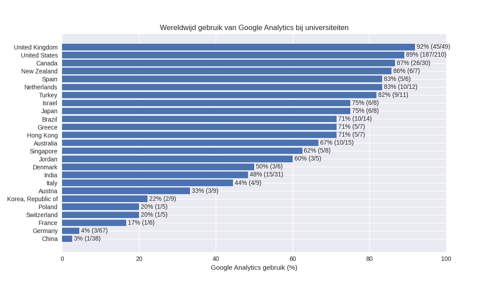
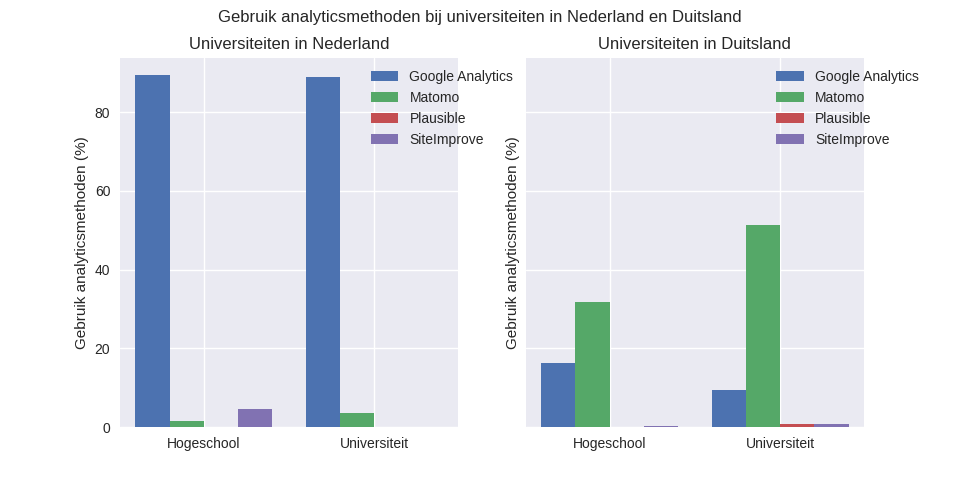
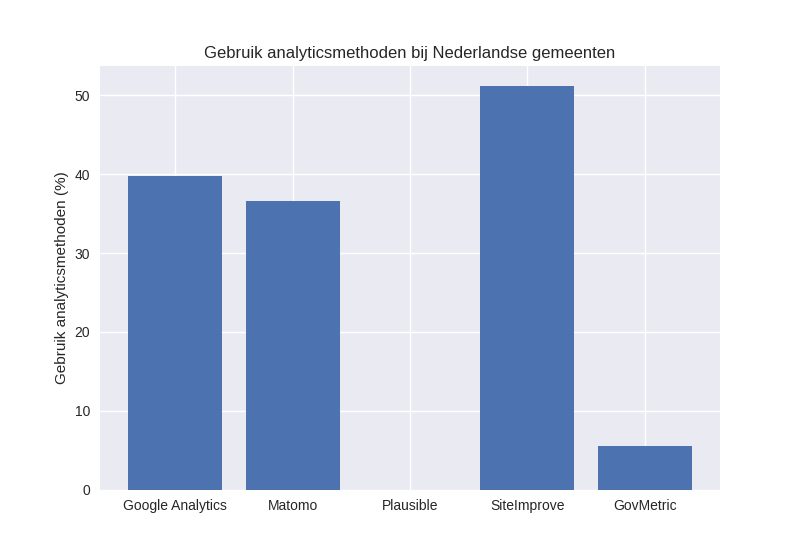

Als onderdeel van project NoGA waren we natuurlijk in eerste instantie op zoek naar alternatieven voor Google Analytics. Maar daarnaast waren we ook erg benieuwd naar welke analytics oplossingen er op dit moment veel gebruikt worden, en op hoeveel websites. Aangezien we al wisten dat Radboud Universiteit Google Analytics actief gebruikt, leek het ons interessant om ook eens te kijken hoe andere universiteiten wereldwijd omgaan met hun Web analytics. Daarnaast keken we ook naar het gebruik van analytics software bij Nederlandse gemeenten. In deze blogpost delen we onze resultaten, om een inzicht te geven in het daadwerkelijke gebruik van verschillende Web analytics tools.

## Universiteiten

Voor een lijst van universitaire websites hebben we gebruik gemaakt van [de CSRankings database](https://csrankings.org). Hier kun je een uitgebreide lijst vinden van onderzoekers in Computer Science, met hun bijbehorende universiteiten en homepages. Door de homepages in deze lijst af te gaan hebben we een overzicht kunnen maken van webpagina's van universiteiten wereldwijd. Vervolgens zijn we deze websites allemaal afgegaan, en hebben we gecontroleerd of ze gebruikmaken van Google Analytics. De resultaten van deze analyse kun je hieronder inzien.

Opvallend is dat er een groot verschil is tussen verschillende landen. Zo blijken universiteiten in landen als het Verenigd Koninkrijk, de Verenigde Staten en Nederland grootgebruikers van Google Analytics. Aan de andere kant van het spectrum vind je bijvoorbeeld Duitsland en China, waar in beide gevallen maar een zeer klein deel van de universitaire websites Google Analytics gebruikt. In het bijzonder de situatie in Duitsland springt eruit, ook een EU land maar met kennelijk een andere houding ten opzichte van Big Tech; een diepgaandere vergelijking tussen Nederland en buurland Duitsland leek hier wel op zijn plaats.

### Nederland vs. Duitsland

Om een betere vergelijking tussen Nederlandse en Duitse onderwijsinstellingen te kunnen maken, hebben we eerst een overzicht gecreëerd van alle Nederlandse en Duitse hogescholen en universiteiten, samen met een link naar hun homepagina's. Deze hebben we simpelweg op de [Nederlandse](https://nl.wikipedia.org/wiki/Lijst_van_hogeronderwijsinstellingen_in_Nederland) en [Duitse](https://de.wikipedia.org/wiki/Liste_der_Hochschulen_in_Deutschland) Wikipedia pagina's kunnen vinden. We kijken nu niet alleen naar het voorkomen van Google Analytics trackers, maar ook naar welke mogelijke alternatieven in gebruik zijn. [Matomo](https://matomo.org) en [Plausible](https://plausible.io) hebben we eerder al langs zien komen in onze blog, en [SiteImprove](https://siteimprove.com) is een privacyvriendelijk alternatief dat we bij gemeenten langs zagen komen.

In de vergelijking hieronder zie je de verdeling van analytics software over de hogescholen en universiteiten van Nederland en Duitsland.

Wederom zien we hier duidelijk dat Duitsland al veel verder is in het overstappen naar privacyvriendelijke Web analytics. Vooral Matomo valt erg in de smaak, met ruim 30% van de hogescholen en 50% van de universiteiten die een eigen Matomo instantie draaien voor hun analytics. In Nederland gebruikt de ruime meerderheid (meer dan 90%) wel gewoon Google Analytics, en slechts op een enkele website wordt een privacyvriendelijk alternatief gebruikt.

## Gemeenten

Als onderdeel van project NoGA hebben we ook met enkele gemeenten gesproken over de keuze voor analytics tools op hun web sites. Zo leerden we dat verschillende gemeenten een privacyvriendelijk alternatief voor Google Analytics in gebruik hebben genomen. Om ook hier een kwantitatief overzicht te krijgen, hebben we de websites van Nederlandse gemeenten [van Wikipedia gehaald](https://nl.wikipedia.org/wiki/Lijst_van_Nederlandse_gemeenten) en geïnspecteerd op de analytics die ze gebruiken. De resultaten hiervan kun je hieronder vinden.

Duidelijk is te zien dat veel gemeenten al gebruikmaken van een privacyvriendelijk alternatief voor Google Analytics - veel vaker dan de Nederlandse universiteiten. Veel gemeenten zijn blijkbaar aangesloten bij SiteImprove, maar er is ook een redelijk deel dat gebruikmaakt van Matomo. Plausible wordt, net als bij de universiteiten, nog niet echt gebruikt.

## Conclusie

In deze blogpost hebben we een overzicht geschetst van het gebruik van verschillende analytics tools in Nederlandse gemeenten en universiteiten wereldwijd. We hebben laten zien dat Nederlandse gemeenten al een stap in de juiste richting hebben gezet, maar vooral Nederlandse onderwijsinstellingen redelijk achterlopen op de overstap naar privacyvriendelijke analytics. Hierin kunnen we leren van onze oosterburen, waar slechts een klein deel van de universiteiten nog maar gebruikmaakt van Google Analytics.

De software die we hebben gebruikt om deze analyses uit te voeren hebben we publiekelijk beschikbaar gemaakt op [onze GitHub pagina](https://github.com/informagi/noga/tree/master/src).
